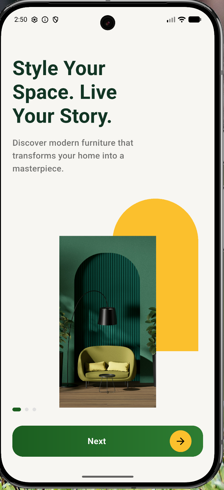
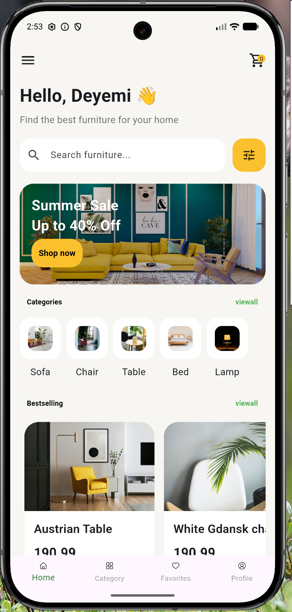
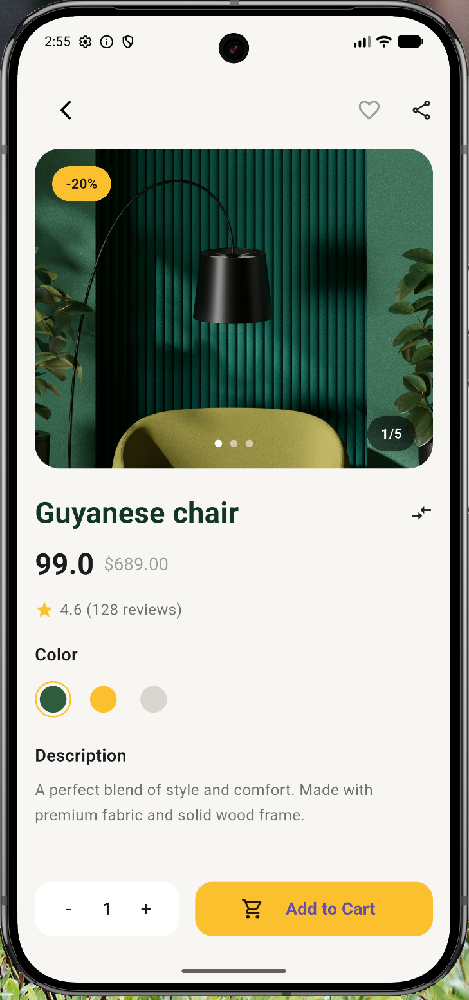
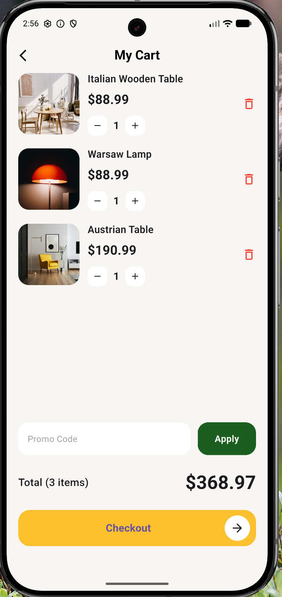
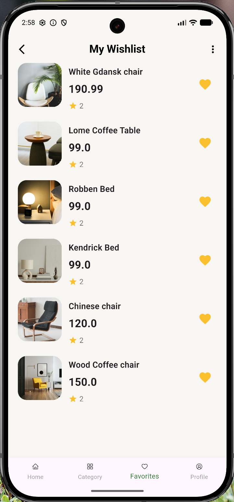
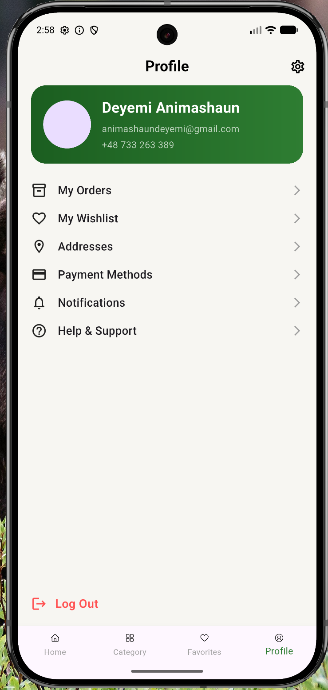

# Furniture App

A modern Flutter-based furniture shopping application with clean UI, smooth navigation, and a professional e-commerce experience.

## Features

- Beautiful onboarding screens
- Modern home page UI
- Product listing section
- Product details page
- Add to cart functionality
- Wishlist section
- Profile page
- Smooth navigation between screens
- Responsive Flutter design
- Clean architecture for scalability

## Tech Stack

- Flutter
- Dart
- Provider (State Management)
- Firebase (if connected)
- Material UI

## Screenshots

(Add your app screenshots here)

### Onboarding Screen


### Home Screen


### Product Details


### Cart Screen


## Project Structure

lib/
│
├── models/
├── providers/
├── screens/
├── widgets/
├── services/
├── data/
└── main.dart

## App Screens

| Onboarding | Home |
|---|---|
| |  |

| Details | Cart |
|---|---|
|  |  |

| Wishlist | Profile |
|---|---|
|  |  |


## Getting Started

### Prerequisites

- [Flutter SDK](https://flutter.dev/?utm_source=chatgpt.com)
- [Visual Studio Code](https://code.visualstudio.com/?utm_source=chatgpt.com) or Android Studio
- Android Emulator or Physical Device

### Installation

1. Clone the repository

```bash
2. git clone https://github.com/adeyemianimashaun/AI-Furniture-App.git

3. cd Furniture-App

4. flutter pub get

5. flutter run